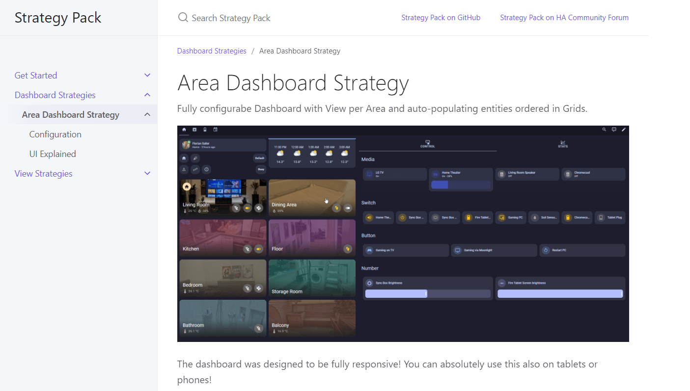

# Strategy Pack

[![Open in HACS at your Home Assistant instance.][hacsBadge]][strategyPackHacs]

This is a collection of [Home Assistant Strategies](https://developers.home-assistant.io/docs/frontend/custom-ui/custom-strategy/).

A strategy is Javascript code that gets executed to create Dashboards and Views automatically. They make it easy to have auto-populated Dashboards with next to no configuration!

## Find out more!

All available Strategies and their Documentation on [the new GitHub Pages Homepage!](https://itsteddyyo.github.io/strategy-pack)

## Credits

Thanks to everyone working on Home Assistant and the everyone in the community. Without your documentation, code, and forum posts, I wouldn't have even thought about this.

The design is heavily inspired by [Dwains Dashboard][dwainsDashboard], as that the first more advanced dashboard i used because the design and auto-population really hit a nerve with me. I wanna thank Dwain for his great work. His Dashboard is more User-friendly and works without any yaml-Knowledge so it is absolutely a better fit for many Users. Give it a try!

Also have a look at [Mushroom Strategy][mushroomStrategy], which has a very similar concept to the Area Strategy. I must admit i also shamelessly copied their installation instructions.

<!-- Badge References -->
[hacsBadge]: https://my.home-assistant.io/badges/hacs_repository.svg
<!-- URL References -->
[strategyPackHacs]: https://my.home-assistant.io/redirect/hacs_repository/?owner=itsteddyyo&repository=strategy-pack&category=Plugin
<!-- Credit References -->
[dwainsDashboard]: https://github.com/dwainscheeren/dwains-lovelace-dashboard
[mushRoomStrategy]: https://github.com/AalianKhan/mushroom-strategy
